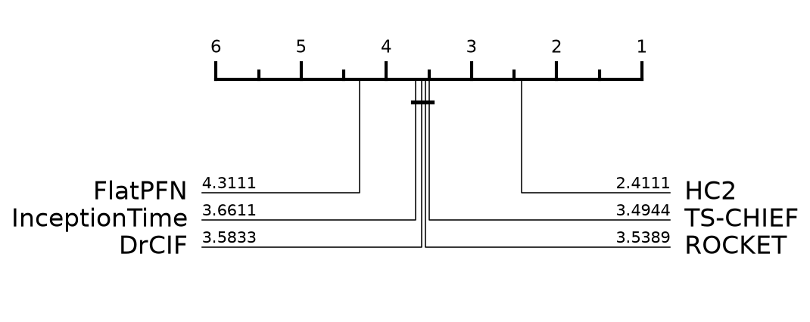

# FlatPFN on UCR

- Datasets: **90** of 92 (pool of 92, seed 42)
- Not in the ranking (failed or not run): Rock, HandOutlines
- Resamples: **1** (resample 0 is the archive default split)
- Comparators: HC2, InceptionTime, ROCKET, DrCIF, TS-CHIEF — published results, not rerun
- TabPFN v3 here; the paper used v2.5

## Average rank (lower is better)

| method | avg rank | mean accuracy |
|---|---|---|
| HC2 | 2.41 | 0.8868 |
| TS-CHIEF | 3.49 | 0.8737 |
| ROCKET | 3.54 | 0.8693 |
| DrCIF | 3.58 | 0.8746 |
| InceptionTime | 3.66 | 0.8681 |
| **FlatPFN** | 4.31 | 0.8339 |

## FlatPFN vs HC2

- mean accuracy: FlatPFN 0.8339 vs HC2 0.8868
- FlatPFN wins on 20, loses 60, ties 10
- Wilcoxon signed-rank (two-sided) p = 0.0000 - significant

## Per-dataset accuracy

| dataset | type | FlatPFN | HC2 | InceptionTime | ROCKET | DrCIF | TS-CHIEF | n_resamples |
|---|---|---|---|---|---|---|---|---|
| SmoothSubspace | Simulated | **1.0000** | 0.9800 | 0.9800 | 0.9733 | 0.9800 | **1.0000** | 1 |
| Chinatown | Traffic | **0.9854** | 0.9825 | **0.9854** | 0.9796 | **0.9854** | 0.9681 | 1 |
| Coffee | Spectro | **1.0000** | **1.0000** | **1.0000** | **1.0000** | **1.0000** | **1.0000** | 1 |
| ECG200 | ECG | 0.8800 | 0.8600 | 0.9100 | **0.9200** | 0.8800 | 0.8400 | 1 |
| BeetleFly | Image | 0.9000 | 0.9500 | 0.8500 | 0.9000 | 0.9000 | **1.0000** | 1 |
| BirdChicken | Image | 0.8000 | 0.9000 | **0.9500** | 0.9000 | **0.9500** | **0.9500** | 1 |
| BME | Simulated | **1.0000** | **1.0000** | **1.0000** | **1.0000** | **1.0000** | 0.9933 | 1 |
| Wine | Spectro | 0.7407 | **0.9259** | 0.6296 | 0.7778 | 0.8519 | 0.8704 | 1 |
| ItalyPowerDemand | Sensor | **0.9708** | 0.9699 | 0.9660 | 0.9699 | 0.9689 | 0.9650 | 1 |
| UMD | Simulated | **1.0000** | 0.9931 | 0.9861 | 0.9931 | 0.9792 | 0.9861 | 1 |
| Beef | Spectro | 0.7667 | 0.8333 | 0.6667 | 0.8000 | **0.8667** | 0.7667 | 1 |
| GunPoint | Motion | 0.9533 | **1.0000** | **1.0000** | **1.0000** | 0.9933 | **1.0000** | 1 |
| Plane | Sensor | **1.0000** | **1.0000** | **1.0000** | **1.0000** | **1.0000** | **1.0000** | 1 |
| OliveOil | Spectro | **0.9667** | 0.8667 | 0.8667 | 0.9000 | 0.9333 | 0.9000 | 1 |
| SyntheticControl | Simulated | 0.9867 | **1.0000** | 0.9967 | **1.0000** | **1.0000** | 0.9967 | 1 |
| FaceFour | Image | 0.9205 | **1.0000** | 0.9545 | 0.9773 | 0.9886 | **1.0000** | 1 |
| DistalPhalanxOutlineAgeGroup | Image | 0.7482 | 0.7626 | 0.7338 | **0.7770** | 0.7626 | 0.7482 | 1 |
| DistalPhalanxTW | Image | 0.7050 | **0.7194** | 0.6547 | 0.7050 | 0.6906 | 0.6763 | 1 |
| SonyAIBORobotSurface1 | Sensor | 0.8369 | 0.9151 | 0.8785 | **0.9251** | 0.9068 | 0.8319 | 1 |
| MiddlePhalanxTW | Image | **0.6039** | 0.5779 | 0.5325 | 0.5390 | 0.5909 | 0.5649 | 1 |
| MiddlePhalanxOutlineAgeGroup | Image | **0.6299** | 0.5779 | 0.5519 | 0.5519 | 0.6039 | 0.5714 | 1 |
| Lightning7 | Sensor | 0.7397 | 0.8082 | 0.7945 | **0.8219** | 0.7534 | 0.7671 | 1 |
| ProximalPhalanxOutlineAgeGroup | Image | 0.8390 | 0.8537 | 0.8488 | **0.8585** | 0.8488 | **0.8585** | 1 |
| ProximalPhalanxTW | Image | 0.8195 | **0.8293** | 0.8000 | 0.8049 | 0.7902 | 0.8244 | 1 |
| PowerCons | Power | **1.0000** | 0.9833 | 0.9944 | 0.9333 | **1.0000** | 0.9889 | 1 |
| ArrowHead | Image | 0.7486 | **0.8686** | 0.8629 | 0.8229 | 0.8400 | 0.8057 | 1 |
| Meat | Spectro | **0.9500** | 0.9333 | **0.9500** | **0.9500** | **0.9500** | 0.8833 | 1 |
| Trace | Sensor | 0.8800 | **1.0000** | **1.0000** | **1.0000** | **1.0000** | **1.0000** | 1 |
| ToeSegmentation2 | Motion | 0.7231 | 0.9385 | 0.9462 | 0.9308 | 0.8923 | **0.9615** | 1 |
| SonyAIBORobotSurface2 | Sensor | 0.8195 | 0.9234 | **0.9517** | 0.9192 | 0.9056 | 0.8961 | 1 |
| Herring | Image | 0.6250 | 0.6094 | **0.7031** | 0.5938 | 0.6406 | 0.6406 | 1 |
| GunPointAgeSpan | Motion | 0.9873 | **1.0000** | 0.9905 | 0.9968 | 0.9905 | **1.0000** | 1 |
| GunPointMaleVersusFemale | Motion | **1.0000** | **1.0000** | **1.0000** | 0.9968 | **1.0000** | **1.0000** | 1 |
| GunPointOldVersusYoung | Motion | **1.0000** | **1.0000** | **1.0000** | 0.9937 | **1.0000** | **1.0000** | 1 |
| Car | Sensor | 0.8167 | **0.9000** | **0.9000** | **0.9000** | 0.8833 | 0.8667 | 1 |
| DistalPhalanxOutlineCorrect | Image | 0.7754 | 0.7754 | **0.7862** | 0.7645 | 0.7826 | 0.7572 | 1 |
| MiddlePhalanxOutlineCorrect | Image | **0.8591** | 0.8488 | 0.8351 | 0.8385 | 0.8316 | 0.8247 | 1 |
| ProximalPhalanxOutlineCorrect | Image | 0.9244 | 0.9003 | **0.9313** | 0.9003 | 0.8969 | 0.8832 | 1 |
| ToeSegmentation1 | Motion | 0.6184 | 0.9649 | 0.9649 | 0.9518 | 0.9342 | **0.9693** | 1 |
| Lightning2 | Sensor | 0.7377 | 0.7869 | **0.8361** | 0.7869 | 0.7705 | **0.8361** | 1 |
| Ham | Spectro | **0.7238** | **0.7238** | **0.7238** | 0.7143 | **0.7238** | 0.7048 | 1 |
| TwoLeadECG | ECG | 0.9605 | **0.9991** | 0.9956 | **0.9991** | 0.9965 | 0.9939 | 1 |
| ShapeletSim | Simulated | 0.4833 | **1.0000** | 0.9944 | **1.0000** | 0.9833 | **1.0000** | 1 |
| MoteStrain | Sensor | 0.8778 | **0.9688** | 0.8938 | 0.9169 | 0.9353 | 0.9273 | 1 |
| DiatomSizeReduction | Image | **0.9771** | 0.9706 | 0.9477 | **0.9771** | 0.9346 | 0.9641 | 1 |
| MedicalImages | Image | **0.8211** | 0.8066 | 0.7961 | 0.8066 | 0.7882 | 0.7961 | 1 |
| CBF | Simulated | 0.9322 | **1.0000** | 0.9989 | **1.0000** | **1.0000** | 0.9978 | 1 |
| ECGFiveDays | ECG | 0.9640 | **1.0000** | **1.0000** | **1.0000** | 0.9988 | **1.0000** | 1 |
| InsectEPGSmallTrain | EPG | **1.0000** | **1.0000** | **1.0000** | 0.9799 | **1.0000** | **1.0000** | 1 |
| Fish | Image | 0.8743 | **0.9943** | 0.9829 | 0.9829 | 0.9486 | **0.9943** | 1 |
| InsectEPGRegularTrain | EPG | **1.0000** | **1.0000** | **1.0000** | **1.0000** | **1.0000** | **1.0000** | 1 |
| OSULeaf | Image | 0.5620 | 0.9669 | 0.9215 | 0.9421 | 0.8554 | **0.9959** | 1 |
| PhalangesOutlinesCorrect | Image | **0.8531** | 0.8380 | 0.8520 | 0.8368 | 0.8357 | 0.8182 | 1 |
| Strawberry | Spectro | 0.9811 | 0.9784 | **0.9838** | 0.9811 | 0.9649 | 0.9703 | 1 |
| Worms | Motion | 0.5844 | 0.7403 | 0.8052 | 0.7273 | 0.7532 | **0.8182** | 1 |
| WormsTwoClass | Motion | 0.6234 | 0.8052 | 0.7662 | 0.8052 | 0.8182 | **0.8312** | 1 |
| Earthquakes | Sensor | **0.7554** | 0.7482 | 0.7122 | 0.7410 | 0.7482 | 0.7482 | 1 |
| ACSF1 | Device | 0.8100 | **0.9100** | **0.9100** | 0.8800 | 0.8800 | 0.8400 | 1 |
| HouseTwenty | Device | 0.8067 | **0.9748** | 0.9160 | 0.9664 | 0.9244 | **0.9748** | 1 |
| Computers | Device | 0.6800 | 0.7600 | **0.8080** | 0.7720 | 0.7360 | 0.7000 | 1 |
| Symbols | Image | 0.8784 | 0.9749 | **0.9849** | 0.9729 | 0.9658 | 0.9779 | 1 |
| Haptics | Motion | 0.4513 | 0.5552 | **0.5714** | 0.5260 | 0.5162 | 0.5292 | 1 |
| LargeKitchenAppliances | Device | 0.6160 | **0.9200** | 0.9040 | 0.8960 | 0.8240 | 0.7680 | 1 |
| RefrigerationDevices | Device | 0.5173 | 0.5520 | 0.5147 | 0.5120 | **0.6053** | 0.5707 | 1 |
| ScreenType | Device | 0.4507 | 0.5707 | **0.5947** | 0.4667 | 0.5253 | 0.4987 | 1 |
| SmallKitchenAppliances | Device | 0.7787 | **0.8373** | 0.7787 | 0.8080 | 0.8213 | 0.8240 | 1 |
| TwoPatterns | Simulated | 0.9730 | **1.0000** | **1.0000** | **1.0000** | 0.9998 | **1.0000** | 1 |
| ECG5000 | ECG | 0.9453 | **0.9469** | 0.9416 | 0.9462 | 0.9416 | 0.9456 | 1 |
| ChlorineConcentration | Sensor | **0.9852** | 0.7589 | 0.8760 | 0.8120 | 0.7404 | 0.6596 | 1 |
| FreezerSmallTrain | Sensor | 0.9811 | 0.9979 | 0.8460 | 0.9512 | **0.9993** | 0.9979 | 1 |
| FreezerRegularTrain | Sensor | 0.9905 | 0.9993 | 0.9968 | 0.9972 | **0.9996** | 0.9975 | 1 |
| Wafer | Sensor | 0.9955 | **1.0000** | 0.9987 | 0.9984 | 0.9987 | 0.9992 | 1 |
| InlineSkate | Motion | 0.3382 | 0.5436 | 0.4855 | 0.4691 | **0.5600** | 0.5273 | 1 |
| SemgHandGenderCh2 | Spectrum | 0.9433 | **0.9617** | 0.8733 | 0.9283 | 0.9383 | 0.9233 | 1 |
| SemgHandMovementCh2 | Spectrum | 0.7956 | 0.8711 | 0.5844 | 0.6289 | 0.8533 | **0.8778** | 1 |
| SemgHandSubjectCh2 | Spectrum | **0.9333** | **0.9333** | 0.7333 | 0.8867 | 0.9244 | 0.9244 | 1 |
| Yoga | Image | 0.8777 | **0.9287** | 0.9050 | 0.9100 | 0.8770 | 0.8543 | 1 |
| UWaveGestureLibraryX | Motion | 0.8110 | **0.8579** | 0.8222 | 0.8534 | 0.8381 | 0.8434 | 1 |
| UWaveGestureLibraryY | Motion | 0.7178 | **0.7814** | 0.7714 | 0.7786 | 0.7741 | 0.7714 | 1 |
| UWaveGestureLibraryZ | Motion | 0.7624 | **0.7987** | 0.7686 | 0.7968 | 0.7767 | 0.7856 | 1 |
| EthanolLevel | Spectro | 0.8180 | 0.6760 | **0.8320** | 0.5980 | 0.5920 | 0.5280 | 1 |
| CinCECGTorso | Sensor | 0.9290 | **1.0000** | 0.8529 | 0.8268 | 0.9993 | 0.9812 | 1 |
| Mallat | Simulated | 0.9684 | **0.9719** | 0.9578 | 0.9561 | 0.9224 | 0.9710 | 1 |
| MixedShapesSmallTrain | Image | 0.8264 | **0.9616** | 0.9109 | 0.9365 | 0.9262 | 0.9493 | 1 |
| MixedShapesRegularTrain | Image | 0.9373 | **0.9753** | 0.9703 | 0.9728 | 0.9567 | 0.9711 | 1 |
| UWaveGestureLibraryAll | Motion | 0.9676 | 0.9746 | 0.9509 | **0.9757** | 0.9732 | 0.9704 | 1 |
| StarLightCurves | Sensor | 0.9790 | **0.9829** | 0.9784 | 0.9811 | 0.9808 | 0.9825 | 1 |
| ElectricDevices | Device | 0.7073 | **0.7613** | 0.7212 | 0.7286 | 0.7356 | 0.7600 | 1 |
| FordB | Sensor | 0.7420 | 0.8370 | **0.8494** | 0.8099 | 0.8123 | 0.8235 | 1 |
| FordA | Sensor | 0.9068 | 0.9561 | 0.9606 | 0.9348 | **0.9682** | 0.9500 | 1 |

## Cost

- median total per dataset per resample: 1.0s
- median Rocket feature time: 0.0s
- median TabPFN time: 1.0s
- total GPU time measured: 0.04h

## Notes

- **TabPFN v3** (`tabpfn` 8.1.0), not the paper's v2.5.
- Raw series values as-is, one column per time step, library defaults. v3 refuses >2000 features, so series longer than 2000 fail by design; the paper's flat comparison also excludes them (90 datasets).
- Baselines are published numbers, never rerun, so only our column is new.

