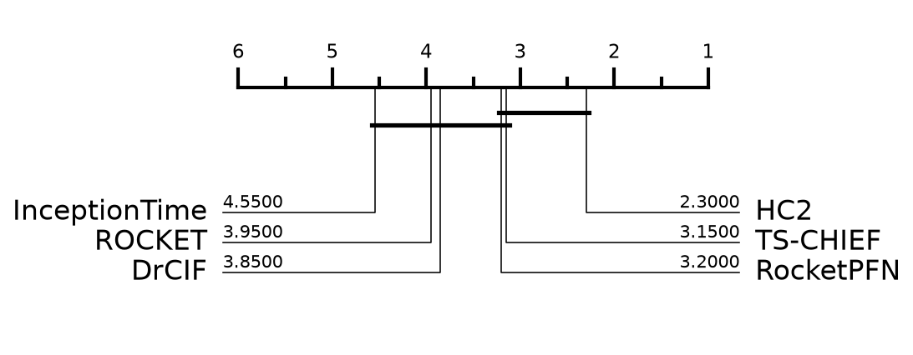

# RocketPFN on UCR — reproduction

- Datasets: **20** of 20 (stratified from a pool of 92, seed 42)
- Resamples: **30** (resample 0 is the archive default split)
- Comparators: HC2, InceptionTime, ROCKET, DrCIF, TS-CHIEF — published results, not rerun
- **Deviation:** TabPFN v3 here; the paper used v2.5

## Average rank (lower is better)

| method | avg rank | mean accuracy |
|---|---|---|
| HC2 | 2.30 | 0.9047 |
| TS-CHIEF | 3.15 | 0.8893 |
| **RocketPFN** | 3.20 | 0.8927 |
| DrCIF | 3.85 | 0.8832 |
| ROCKET | 3.95 | 0.8853 |
| InceptionTime | 4.55 | 0.8722 |

## RocketPFN vs HC2

- mean accuracy: RocketPFN 0.8927 vs HC2 0.9047
- RocketPFN wins on 5, loses 13, ties 2
- Wilcoxon signed-rank (two-sided) p = 0.0778

## Per-dataset accuracy

| dataset | type | RocketPFN | HC2 | InceptionTime | ROCKET | DrCIF | TS-CHIEF | n_resamples |
|---|---|---|---|---|---|---|---|---|
| ACSF1 | Device | **0.8667** | 0.8480 | 0.8267 | 0.8083 | 0.7827 | 0.8070 | 30 |
| BeetleFly | Image | 0.8817 | 0.9233 | 0.8933 | 0.8900 | 0.8850 | **0.9583** | 30 |
| DistalPhalanxOutlineAgeGroup | Image | 0.8065 | 0.8134 | 0.7657 | 0.7988 | 0.8218 | **0.8281** | 30 |
| ECG5000 | ECG | 0.9478 | 0.9484 | 0.9421 | 0.9479 | 0.9456 | **0.9485** | 30 |
| Fish | Image | 0.9642 | **0.9821** | 0.9728 | 0.9800 | 0.9440 | 0.9815 | 30 |
| FreezerRegularTrain | Sensor | 0.9989 | 0.9994 | 0.9957 | 0.9955 | **0.9994** | 0.9985 | 30 |
| FreezerSmallTrain | Sensor | 0.9904 | 0.9945 | 0.9488 | 0.9895 | **0.9991** | 0.9955 | 30 |
| Ham | Spectro | 0.8289 | 0.8597 | 0.8505 | **0.8619** | 0.8194 | 0.8051 | 30 |
| ItalyPowerDemand | Sensor | 0.9627 | 0.9630 | 0.9603 | 0.9609 | **0.9631** | 0.9624 | 30 |
| MixedShapesSmallTrain | Image | 0.9379 | **0.9544** | 0.9133 | 0.9304 | 0.9173 | 0.9473 | 30 |
| PhalangesOutlinesCorrect | Image | **0.8683** | 0.8430 | 0.8613 | 0.8493 | 0.8447 | 0.8253 | 30 |
| Plane | Sensor | **1.0000** | **1.0000** | 0.9968 | **1.0000** | **1.0000** | **1.0000** | 30 |
| Rock | Spectrum | 0.7760 | **0.8773** | 0.6280 | 0.8113 | 0.8480 | 0.8320 | 30 |
| ScreenType | Device | 0.6968 | **0.7540** | 0.7060 | 0.6156 | 0.6597 | 0.5942 | 30 |
| ShapeletSim | Simulated | **1.0000** | **1.0000** | 0.9235 | 0.9972 | 0.9754 | **1.0000** | 30 |
| SmoothSubspace | Simulated | 0.9571 | 0.9802 | 0.9847 | 0.9742 | 0.9896 | **0.9973** | 30 |
| UWaveGestureLibraryX | Motion | **0.8657** | 0.8632 | 0.8335 | 0.8591 | 0.8456 | 0.8468 | 30 |
| UWaveGestureLibraryZ | Motion | **0.8077** | 0.8008 | 0.7732 | 0.7981 | 0.7901 | 0.7912 | 30 |
| Wine | Spectro | 0.9340 | **0.9414** | 0.8870 | 0.9204 | 0.8846 | 0.8981 | 30 |
| Worms | Motion | 0.7632 | 0.7485 | **0.7810** | 0.7182 | 0.7498 | 0.7684 | 30 |

## Cost

- median total per dataset per resample: 30.5s
- median Rocket feature time: 2.2s
- median TabPFN time: 28.3s
- total GPU time measured: 7.51h

## Deviations from the paper

- **TabPFN v3** (`tabpfn` 8.1.0), not the paper's v2.5.
- **20 datasets**, not 92 — a stratified sample fixed in `configs/ucr20.json` before any result existed.
- v3 shows each ensemble member only ~200 features and auto-scales `n_estimators` 8 -> 10 to cover Rocket's 2000, so one group is ~10 forward passes rather than one.
- Installing `aeon` moved the shared env: pandas 3.0.5 -> 2.3.3, numpy 2.4.6 -> 2.3.5, scikit-learn 1.9.0 -> 1.8.0.
- Baselines are published numbers, never rerun, so only our column is new.

