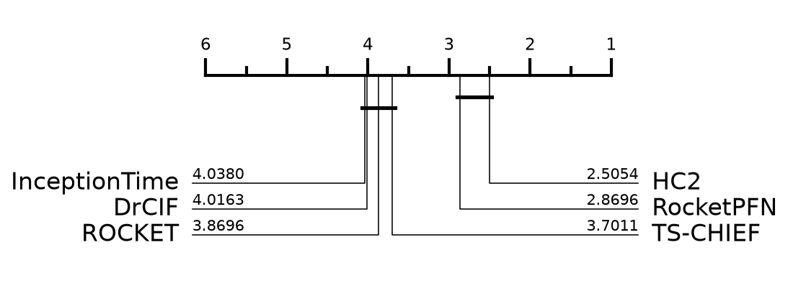

# RocketPFN on UCR — reproduction

- Datasets: **92** of 92 (stratified from a pool of 92, seed 42)
- Resamples: **30** (resample 0 is the archive default split)
- Comparators: HC2, InceptionTime, ROCKET, DrCIF, TS-CHIEF — published results, not rerun
- **Deviation:** TabPFN v3 here; the paper used v2.5

## Average rank (lower is better)

| method | avg rank | mean accuracy |
|---|---|---|
| HC2 | 2.51 | 0.9005 |
| **RocketPFN** | 2.87 | 0.8954 |
| TS-CHIEF | 3.70 | 0.8843 |
| ROCKET | 3.87 | 0.8818 |
| DrCIF | 4.02 | 0.8841 |
| InceptionTime | 4.04 | 0.8799 |

## RocketPFN vs HC2

- mean accuracy: RocketPFN 0.8954 vs HC2 0.9005
- RocketPFN wins on 37, loses 50, ties 5
- Wilcoxon signed-rank (two-sided) p = 0.1408

## Per-dataset accuracy

| dataset | type | RocketPFN | HC2 | InceptionTime | ROCKET | DrCIF | TS-CHIEF | n_resamples |
|---|---|---|---|---|---|---|---|---|
| SmoothSubspace | Simulated | 0.9571 | 0.9802 | 0.9847 | 0.9742 | 0.9896 | **0.9973** | 30 |
| Chinatown | Traffic | 0.9699 | 0.9689 | 0.9648 | 0.9676 | **0.9751** | 0.9618 | 30 |
| Coffee | Spectro | **1.0000** | **1.0000** | 0.9988 | **1.0000** | 0.9976 | 0.9905 | 30 |
| ECG200 | ECG | **0.9067** | 0.8963 | 0.8967 | 0.9030 | 0.8620 | 0.8550 | 30 |
| BeetleFly | Image | 0.8817 | 0.9233 | 0.8933 | 0.8900 | 0.8850 | **0.9583** | 30 |
| BirdChicken | Image | 0.9150 | 0.9483 | 0.9517 | 0.9000 | 0.9517 | **0.9633** | 30 |
| BME | Simulated | 0.9967 | 0.9987 | 0.9964 | 0.9971 | **0.9989** | 0.9964 | 30 |
| Wine | Spectro | 0.9340 | **0.9414** | 0.8870 | 0.9204 | 0.8846 | 0.8981 | 30 |
| ItalyPowerDemand | Sensor | 0.9627 | 0.9630 | 0.9603 | 0.9609 | **0.9631** | 0.9624 | 30 |
| UMD | Simulated | **0.9863** | 0.9861 | 0.9799 | 0.9826 | 0.9102 | 0.9833 | 30 |
| Beef | Spectro | 0.7500 | 0.7211 | 0.6822 | 0.7522 | **0.7944** | 0.6322 | 30 |
| GunPoint | Motion | 0.9947 | 0.9984 | 0.9951 | 0.9931 | 0.9902 | **1.0000** | 30 |
| Plane | Sensor | **1.0000** | **1.0000** | 0.9968 | **1.0000** | **1.0000** | **1.0000** | 30 |
| OliveOil | Spectro | 0.8911 | 0.8878 | 0.8744 | 0.8978 | 0.9078 | **0.9167** | 30 |
| SyntheticControl | Simulated | 0.9968 | 0.9987 | 0.9958 | 0.9974 | 0.9933 | **0.9990** | 30 |
| FaceFour | Image | 0.9364 | 0.9792 | 0.9386 | 0.9295 | 0.9511 | **0.9996** | 30 |
| DistalPhalanxOutlineAgeGroup | Image | 0.8065 | 0.8134 | 0.7657 | 0.7988 | 0.8218 | **0.8281** | 30 |
| DistalPhalanxTW | Image | **0.7175** | 0.7094 | 0.6655 | 0.6945 | 0.6962 | 0.6918 | 30 |
| SonyAIBORobotSurface1 | Sensor | **0.9619** | 0.9501 | 0.9542 | 0.9581 | 0.9182 | 0.8897 | 30 |
| MiddlePhalanxTW | Image | **0.5935** | 0.5699 | 0.5275 | 0.5446 | 0.5922 | 0.5732 | 30 |
| MiddlePhalanxOutlineAgeGroup | Image | **0.7348** | 0.6894 | 0.5944 | 0.6268 | 0.7123 | 0.6944 | 30 |
| Lightning7 | Sensor | **0.8219** | 0.7932 | 0.8205 | 0.8009 | 0.7525 | 0.7936 | 30 |
| ProximalPhalanxOutlineAgeGroup | Image | **0.8582** | 0.8571 | 0.8221 | 0.8455 | 0.8496 | 0.8463 | 30 |
| ProximalPhalanxTW | Image | **0.8242** | 0.8132 | 0.7816 | 0.8005 | 0.8128 | 0.8111 | 30 |
| PowerCons | Power | 0.9578 | 0.9757 | 0.9863 | 0.9539 | **0.9881** | 0.9794 | 30 |
| ArrowHead | Image | 0.8806 | **0.8992** | 0.8804 | 0.8690 | 0.8280 | 0.8811 | 30 |
| Meat | Spectro | 0.9883 | 0.9844 | 0.9844 | **0.9911** | 0.9794 | 0.9844 | 30 |
| Trace | Sensor | **1.0000** | **1.0000** | **1.0000** | **1.0000** | **1.0000** | **1.0000** | 30 |
| ToeSegmentation2 | Motion | 0.9262 | **0.9638** | 0.9636 | 0.9336 | 0.9054 | 0.9626 | 30 |
| SonyAIBORobotSurface2 | Sensor | 0.9298 | 0.9404 | **0.9513** | 0.9359 | 0.9271 | 0.9011 | 30 |
| Herring | Image | **0.6323** | 0.6193 | 0.6250 | 0.6146 | 0.5984 | 0.5974 | 30 |
| GunPointAgeSpan | Motion | 0.9905 | 0.9965 | 0.9841 | 0.9938 | 0.9910 | **0.9996** | 30 |
| GunPointMaleVersusFemale | Motion | 0.9985 | **0.9998** | 0.9983 | 0.9998 | 0.9991 | 0.9994 | 30 |
| GunPointOldVersusYoung | Motion | 0.9911 | 0.9999 | **1.0000** | 0.9894 | **1.0000** | **1.0000** | 30 |
| Car | Sensor | 0.9100 | **0.9206** | 0.9011 | 0.9172 | 0.8489 | 0.8789 | 30 |
| DistalPhalanxOutlineCorrect | Image | **0.8364** | 0.8281 | 0.8153 | 0.8234 | 0.8324 | 0.8193 | 30 |
| MiddlePhalanxOutlineCorrect | Image | **0.8491** | 0.8306 | 0.8342 | 0.8379 | 0.8239 | 0.8058 | 30 |
| ProximalPhalanxOutlineCorrect | Image | 0.9015 | 0.8918 | **0.9063** | 0.8990 | 0.8928 | 0.8755 | 30 |
| ToeSegmentation1 | Motion | 0.9348 | 0.9554 | 0.9531 | 0.9301 | 0.9053 | **0.9598** | 30 |
| Lightning2 | Sensor | **0.8251** | 0.7699 | 0.8169 | 0.7858 | 0.7492 | 0.7689 | 30 |
| Ham | Spectro | 0.8289 | 0.8597 | 0.8505 | **0.8619** | 0.8194 | 0.8051 | 30 |
| TwoLeadECG | ECG | 0.9977 | 0.9982 | 0.9948 | **0.9987** | 0.9819 | 0.9901 | 30 |
| ShapeletSim | Simulated | **1.0000** | **1.0000** | 0.9235 | 0.9972 | 0.9754 | **1.0000** | 30 |
| MoteStrain | Sensor | 0.9042 | 0.9285 | 0.8806 | 0.9061 | 0.9037 | **0.9301** | 30 |
| DiatomSizeReduction | Image | **0.9678** | 0.9291 | 0.9509 | 0.9618 | 0.9131 | 0.9459 | 30 |
| MedicalImages | Image | **0.8414** | 0.8111 | 0.7964 | 0.8064 | 0.8021 | 0.7991 | 30 |
| CBF | Simulated | **0.9996** | 0.9985 | 0.9961 | 0.9962 | 0.9866 | 0.9984 | 30 |
| ECGFiveDays | ECG | 0.9930 | 0.9918 | 0.9959 | **0.9965** | 0.9906 | 0.9944 | 30 |
| InsectEPGSmallTrain | EPG | 0.9289 | **1.0000** | **1.0000** | 0.9351 | **1.0000** | **1.0000** | 30 |
| Fish | Image | 0.9642 | **0.9821** | 0.9728 | 0.9800 | 0.9440 | 0.9815 | 30 |
| InsectEPGRegularTrain | EPG | 0.9850 | **1.0000** | **1.0000** | 0.9865 | **1.0000** | **1.0000** | 30 |
| OSULeaf | Image | 0.9574 | 0.9686 | 0.9525 | 0.9395 | 0.8620 | **0.9736** | 30 |
| Rock | Spectrum | 0.7760 | **0.8773** | 0.6280 | 0.8113 | 0.8480 | 0.8320 | 30 |
| PhalangesOutlinesCorrect | Image | **0.8683** | 0.8430 | 0.8613 | 0.8493 | 0.8447 | 0.8253 | 30 |
| Strawberry | Spectro | **0.9828** | 0.9803 | 0.9755 | 0.9791 | 0.9748 | 0.9740 | 30 |
| Worms | Motion | 0.7632 | 0.7485 | **0.7810** | 0.7182 | 0.7498 | 0.7684 | 30 |
| WormsTwoClass | Motion | 0.7935 | 0.8030 | 0.8026 | 0.7784 | **0.8078** | 0.7861 | 30 |
| Earthquakes | Sensor | 0.7463 | 0.7468 | 0.7312 | 0.7434 | **0.7482** | **0.7482** | 30 |
| ACSF1 | Device | **0.8667** | 0.8480 | 0.8267 | 0.8083 | 0.7827 | 0.8070 | 30 |
| HouseTwenty | Device | 0.9599 | **0.9840** | 0.9532 | 0.9630 | 0.9387 | 0.9703 | 30 |
| Computers | Device | **0.8757** | 0.8619 | 0.8659 | 0.8468 | 0.8180 | 0.7539 | 30 |
| Symbols | Image | 0.9727 | **0.9728** | 0.9696 | 0.9680 | 0.9654 | 0.9708 | 30 |
| Haptics | Motion | 0.5342 | **0.5534** | 0.5370 | 0.5298 | 0.5181 | 0.5233 | 30 |
| LargeKitchenAppliances | Device | 0.9430 | 0.9393 | **0.9525** | 0.9302 | 0.8663 | 0.8602 | 30 |
| RefrigerationDevices | Device | 0.7864 | **0.8168** | 0.7589 | 0.7319 | 0.7417 | 0.7268 | 30 |
| ScreenType | Device | 0.6968 | **0.7540** | 0.7060 | 0.6156 | 0.6597 | 0.5942 | 30 |
| SmallKitchenAppliances | Device | **0.8462** | 0.8424 | 0.7708 | 0.8209 | 0.8458 | 0.8380 | 30 |
| TwoPatterns | Simulated | **1.0000** | **1.0000** | **1.0000** | **1.0000** | 0.9996 | 1.0000 | 30 |
| ECG5000 | ECG | 0.9478 | 0.9484 | 0.9421 | 0.9479 | 0.9456 | **0.9485** | 30 |
| ChlorineConcentration | Sensor | 0.7683 | 0.7634 | **0.8636** | 0.7939 | 0.7387 | 0.6608 | 30 |
| FreezerSmallTrain | Sensor | 0.9904 | 0.9945 | 0.9488 | 0.9895 | **0.9991** | 0.9955 | 30 |
| FreezerRegularTrain | Sensor | 0.9989 | 0.9994 | 0.9957 | 0.9955 | **0.9994** | 0.9985 | 30 |
| Wafer | Sensor | 0.9986 | **1.0000** | 0.9986 | 0.9986 | 0.9996 | 0.9989 | 30 |
| InlineSkate | Motion | 0.5187 | 0.5262 | 0.5344 | 0.4849 | 0.5639 | **0.5719** | 30 |
| SemgHandGenderCh2 | Spectrum | 0.9697 | **0.9727** | 0.8847 | 0.9241 | 0.9518 | 0.9389 | 30 |
| SemgHandMovementCh2 | Spectrum | 0.8776 | **0.9035** | 0.5516 | 0.6530 | 0.8753 | 0.8850 | 30 |
| SemgHandSubjectCh2 | Spectrum | 0.9547 | **0.9550** | 0.7629 | 0.9107 | 0.9357 | 0.9331 | 30 |
| Yoga | Image | 0.9115 | **0.9293** | 0.9124 | 0.9137 | 0.8899 | 0.8726 | 30 |
| UWaveGestureLibraryX | Motion | **0.8657** | 0.8632 | 0.8335 | 0.8591 | 0.8456 | 0.8468 | 30 |
| UWaveGestureLibraryY | Motion | **0.8004** | 0.7896 | 0.7708 | 0.7885 | 0.7761 | 0.7880 | 30 |
| UWaveGestureLibraryZ | Motion | **0.8077** | 0.8008 | 0.7732 | 0.7981 | 0.7901 | 0.7912 | 30 |
| EthanolLevel | Spectro | 0.8305 | 0.8155 | **0.8751** | 0.6371 | 0.7715 | 0.6056 | 30 |
| CinCECGTorso | Sensor | 0.8510 | **0.9930** | 0.8321 | 0.8624 | 0.9926 | 0.9534 | 30 |
| Mallat | Simulated | 0.9755 | 0.9766 | 0.9626 | 0.9580 | **0.9780** | 0.9767 | 30 |
| MixedShapesSmallTrain | Image | 0.9379 | **0.9544** | 0.9133 | 0.9304 | 0.9173 | 0.9473 | 30 |
| MixedShapesRegularTrain | Image | 0.9689 | **0.9747** | 0.9664 | 0.9656 | 0.9593 | 0.9714 | 30 |
| HandOutlines | Image | **0.9474** | 0.9377 | 0.9430 | 0.9427 | 0.9145 | 0.9373 | 30 |
| UWaveGestureLibraryAll | Motion | 0.9733 | 0.9752 | 0.9512 | **0.9773** | 0.9720 | 0.9707 | 30 |
| StarLightCurves | Sensor | **0.9821** | 0.9819 | 0.9781 | 0.9812 | 0.9798 | 0.9811 | 30 |
| ElectricDevices | Device | **0.9072** | 0.9017 | 0.8902 | 0.8927 | 0.8828 | 0.8650 | 30 |
| FordB | Sensor | 0.9220 | 0.9339 | **0.9407** | 0.9135 | 0.9216 | 0.9195 | 30 |
| FordA | Sensor | 0.9420 | 0.9552 | 0.9590 | 0.9336 | **0.9654** | 0.9474 | 30 |

## Cost

- median total per dataset per resample: 29.8s
- median Rocket feature time: 1.2s
- median TabPFN time: 28.3s
- total GPU time measured: 33.15h

## Deviations from the paper

- **TabPFN v3** (`tabpfn` 8.1.0), not the paper's v2.5.
- **20 datasets**, not 92 — a stratified sample fixed in `configs/ucr20.json` before any result existed.
- v3 shows each ensemble member only ~200 features and auto-scales `n_estimators` 8 -> 10 to cover Rocket's 2000, so one group is ~10 forward passes rather than one.
- Installing `aeon` moved the shared env: pandas 3.0.5 -> 2.3.3, numpy 2.4.6 -> 2.3.5, scikit-learn 1.9.0 -> 1.8.0.
- Baselines are published numbers, never rerun, so only our column is new.

