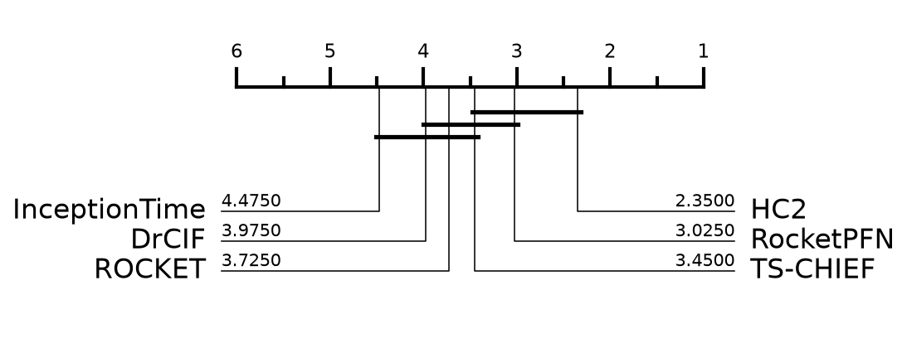

# RocketPFN on UCR — reproduction

- Datasets: **20** of 20 (stratified from a pool of 92, seed 42)
- Resamples: **1** (resample 0 is the archive default split)
- Comparators: HC2, InceptionTime, ROCKET, DrCIF, TS-CHIEF — published results, not rerun
- **Deviation:** TabPFN v3 here; the paper used v2.5

## Average rank (lower is better)

| method | avg rank | mean accuracy |
|---|---|---|
| HC2 | 2.35 | 0.8914 |
| **RocketPFN** | 3.02 | 0.8812 |
| TS-CHIEF | 3.45 | 0.8838 |
| ROCKET | 3.73 | 0.8694 |
| DrCIF | 3.98 | 0.8657 |
| InceptionTime | 4.47 | 0.8454 |

## RocketPFN vs HC2

- mean accuracy: RocketPFN 0.8812 vs HC2 0.8914
- RocketPFN wins on 7, loses 10, ties 3
- Wilcoxon signed-rank p = 0.7963

## Per-dataset accuracy

| dataset | type | RocketPFN | HC2 | InceptionTime | ROCKET | DrCIF | TS-CHIEF | n_resamples |
|---|---|---|---|---|---|---|---|---|
| ACSF1 | Device | **0.9500** | 0.9100 | 0.9100 | 0.8800 | 0.8800 | 0.8400 | 1 |
| BeetleFly | Image | 0.8500 | 0.9500 | 0.8500 | 0.9000 | 0.9000 | **1.0000** | 1 |
| DistalPhalanxOutlineAgeGroup | Image | 0.7266 | 0.7626 | 0.7338 | **0.7770** | 0.7626 | 0.7482 | 1 |
| ECG5000 | ECG | **0.9496** | 0.9469 | 0.9416 | 0.9462 | 0.9416 | 0.9456 | 1 |
| Fish | Image | 0.9714 | **0.9943** | 0.9829 | 0.9829 | 0.9486 | **0.9943** | 1 |
| FreezerRegularTrain | Sensor | 0.9989 | 0.9993 | 0.9968 | 0.9972 | **0.9996** | 0.9975 | 1 |
| FreezerSmallTrain | Sensor | 0.9947 | 0.9979 | 0.8460 | 0.9512 | **0.9993** | 0.9979 | 1 |
| Ham | Spectro | **0.8000** | 0.7238 | 0.7238 | 0.7143 | 0.7238 | 0.7048 | 1 |
| ItalyPowerDemand | Sensor | **0.9699** | **0.9699** | 0.9660 | **0.9699** | 0.9689 | 0.9650 | 1 |
| MixedShapesSmallTrain | Image | 0.9361 | **0.9616** | 0.9109 | 0.9365 | 0.9262 | 0.9493 | 1 |
| PhalangesOutlinesCorrect | Image | **0.8636** | 0.8380 | 0.8520 | 0.8368 | 0.8357 | 0.8182 | 1 |
| Plane | Sensor | **1.0000** | **1.0000** | **1.0000** | **1.0000** | **1.0000** | **1.0000** | 1 |
| Rock | Spectrum | 0.8200 | **0.9000** | 0.6000 | **0.9000** | 0.7200 | **0.9000** | 1 |
| ScreenType | Device | 0.5573 | 0.5707 | **0.5947** | 0.4667 | 0.5253 | 0.4987 | 1 |
| ShapeletSim | Simulated | **1.0000** | **1.0000** | 0.9944 | **1.0000** | 0.9833 | **1.0000** | 1 |
| SmoothSubspace | Simulated | 0.9467 | 0.9800 | 0.9800 | 0.9733 | 0.9800 | **1.0000** | 1 |
| UWaveGestureLibraryX | Motion | **0.8587** | 0.8579 | 0.8222 | 0.8534 | 0.8381 | 0.8434 | 1 |
| UWaveGestureLibraryZ | Motion | **0.8004** | 0.7987 | 0.7686 | 0.7968 | 0.7767 | 0.7856 | 1 |
| Wine | Spectro | 0.7593 | **0.9259** | 0.6296 | 0.7778 | 0.8519 | 0.8704 | 1 |
| Worms | Motion | **0.8701** | 0.7403 | 0.8052 | 0.7273 | 0.7532 | 0.8182 | 1 |

## Cost

- median total per dataset per resample: 30.8s
- median Rocket feature time: 2.2s
- median TabPFN time: 28.4s
- total GPU time measured: 0.28h

